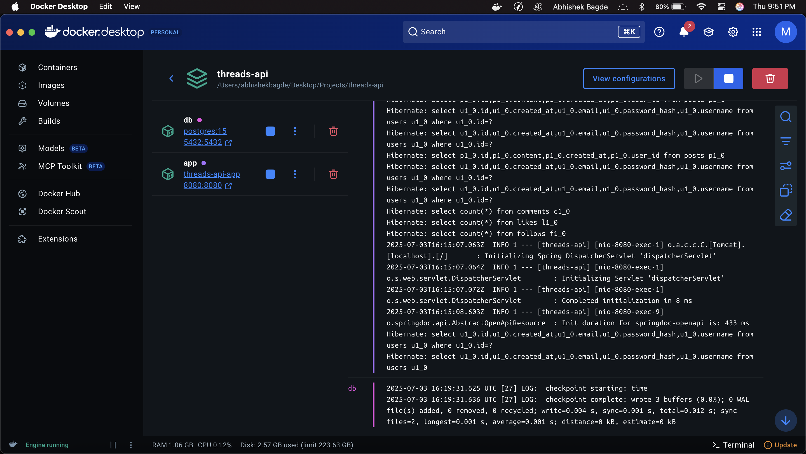
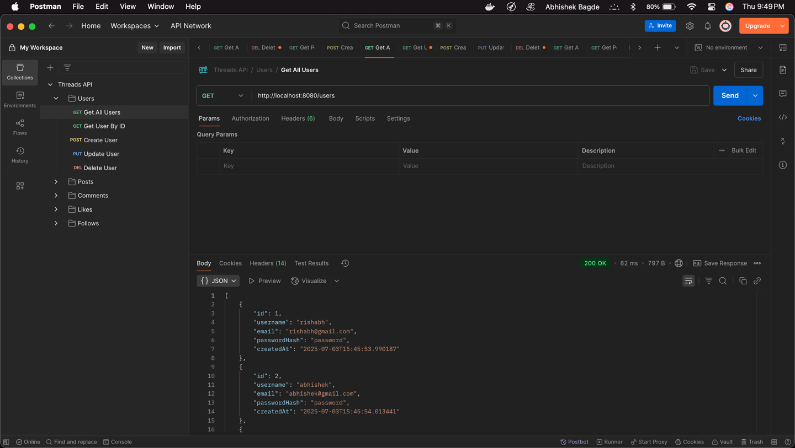
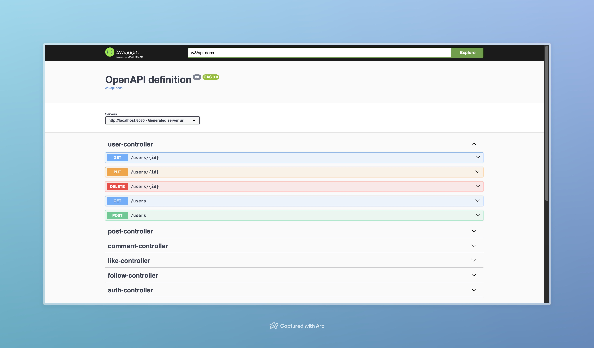
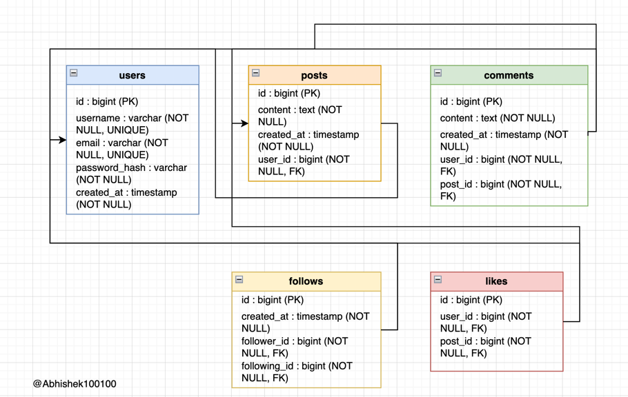

# Threads Backend API

Hi! 👋 I built this project to learn and demonstrate real-world backend engineering using **Spring Boot** and **PostgreSQL**. This API powers a Threads-style social network, where users can post, comment, like, and follow each other—just like on Twitter or Instagram.

I wanted to make something that’s not only functional, but also easy for anyone to run, test, and extend. That’s why it’s fully dockerized, seeded with demo data, and comes with interactive API docs out of the box.

##  Features

- **User Management:** Register, update, and delete users.
- **Posts:** Create, read, update, and delete posts linked to users.
- **Comments:** Comment on posts, with full user and post linkage.
- **Likes:** Like posts (with user and post relationships).
- **Follows:** Follow/unfollow other users.
- **Robust Data Integrity:** All relationships are enforced by foreign keys and NOT NULL constraints.
- **Seeder:** Automatic database seeding with demo data.
- **Ready-to-import Postman Collection:** For instant API testing.
- **Interactive API Docs:** Built-in Swagger/OpenAPI UI.

## Screenshots

### 1. Docker Compose Running the Full Stack

*Both the backend and PostgreSQL database running smoothly in Docker Desktop, with live logs showing app startup and database activity.*

### 2. Example API Call in Postman

*Testing the `/users` endpoint in Postman, confirming the API returns real user data.*

### 3. Interactive API Docs (Swagger UI)

*Auto-generated, interactive API documentation with Swagger UI—explore and test every endpoint right in your browser.*

## 4. Database Schema (ER Diagram)

*This diagram shows the relationships between all tables in the Threads API backend*


- **Java 17**
- **Spring Boot 3**
- **Spring Data JPA**
- **PostgreSQL**
- **Maven**
- **Docker & Docker Compose**
- **Postman** (for API testing)
- **Swagger/OpenAPI** (for live docs)

##  Getting Started

### 1. Clone the Repository

```bash
git clone https://github.com/Abhishek100100/threads-backend-api.git
cd threads-backend-api
```

### 2. Run with Docker (Recommended)

You can run the entire backend and PostgreSQL database with one command using Docker Compose.

```bash
docker-compose up --build
```

- This will start both the backend and the database.
- The API will be available at [http://localhost:8080](http://localhost:8080).
- Swagger docs will be at [http://localhost:8080/swagger-ui.html](http://localhost:8080/swagger-ui.html).

To stop everything:
```bash
docker-compose down
```

> **Note:** Make sure Docker Desktop is running before you use these commands.

### 3. (Alternative) Run Locally Without Docker

- Make sure PostgreSQL is running and you have created the database and user (see below).
- Update `src/main/resources/application.properties` with your DB credentials.
- Build and run:

```bash
mvn clean package
java -jar target/threads-api-0.0.1-SNAPSHOT.jar
```

## Database Setup (If Not Using Docker)

If you want to set up the database manually:

```sql
CREATE DATABASE threads;
CREATE USER threadsuser WITH PASSWORD 'threadspass';
GRANT ALL PRIVILEGES ON DATABASE threads TO threadsuser;
```

Update your `application.properties`:

```
spring.datasource.url=jdbc:postgresql://localhost:5432/threads
spring.datasource.username=threadsuser
spring.datasource.password=threadspass
spring.jpa.hibernate.ddl-auto=update
```

## API Documentation (Swagger UI)

After starting the app, visit [http://localhost:8080/swagger-ui.html](http://localhost:8080/swagger-ui.html)  
You’ll find interactive, auto-generated documentation for all API endpoints.

## API Testing

- Import the provided Postman collection (`threads-api-final.postman_collection.json`) into Postman.
- All endpoints are ready to test, with sample bodies for each entity.
- Make sure to use valid IDs for relationships (e.g., `user: { "id": 2 }`).

## Data Seeding

- On first run, the app seeds the database with demo users, posts, comments, likes, and follows.
- Seeder logic is idempotent: no duplicate data on restart.

##  Database Schema

- All tables (`users`, `posts`, `comments`, `likes`, `follows`) are fully normalized.
- Foreign key constraints and NOT NULL rules prevent orphaned or invalid data.
- Timestamps (`created_at`) are set automatically in the backend.


## To Do

- Add JWT-based authentication and authorization
- Pagination and filtering for large datasets
- User profile endpoints and avatars
- Notification system for likes/comments/follows
- Frontend integration (React, Vue, etc.)


*Made with ☕, Spring Boot, Docker, and a lot of debugging!*
